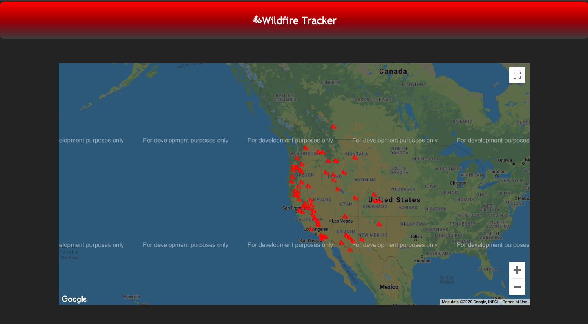

# Wildfire Tracker

This application is built using React and tracks wildfires in real time all across the globe. This app uses Google Maps React and Iconify as well.

To use this application:

<ul>
    <li>Clone this repository</li>
    <li>Generate your own API Key at Google Cloud Platform using the Google Maps JavaScript API.</li>
    <li>Run <code>npm install</code> at the root directory</li>
</ul>

