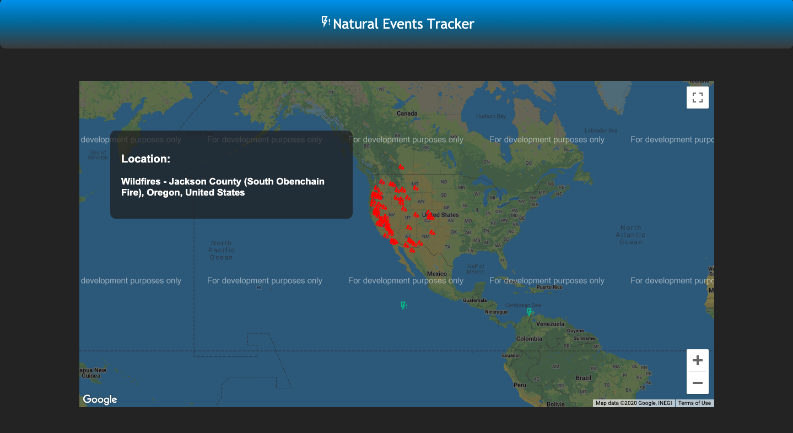

# Natural Event Tracker

This application is built using NASA's EONET (Earth's Observatory Natural Event Tracker) API and tracks wildfires, severe storms and icebergs in real time.

To use this application:

<ul>
    <li>Clone this repository</li>
    <li>Generate your own API Key at Google Cloud Platform using the Google Maps JavaScript API.</li>
    <li>Run <code>npm install</code> at the root directory</li>
</ul>

